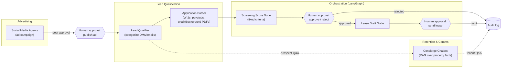

# DC Rental Property — AI Automation Architecture & Plan

Architecture and implementation plan for an AI-assisted tenant-screening and
property-management pipeline for a 4-unit DC property: advertising vacancies,
qualifying leads, screening applicants, and handling tenant communication —
with a human approving every consequential decision.

This document replaces the previous contents of this repository (an
unrelated travel-planning agent prototype).

## Guiding principle

Automation should do the *work* (drafting, extracting, scoring, scheduling);
a human should make every *consequential decision* (rejecting an applicant,
sending a lease, posting an ad, sending a legal notice). This isn't just a
design preference — under the Fair Housing Act, screening criteria must be
applied consistently and defensibly, which argues for a human checkpoint and
an audit trail on every automated recommendation, not silent auto-rejection.

## System overview



## Component evaluation

### 1. Orchestration & human-in-the-loop — LangGraph

LangGraph fits because it is a stateful graph framework with a first-class
`interrupt()` primitive: a node can pause execution, hand control back to a
human, and resume later from a checkpoint without losing state — exactly the
shape of "pause before rejecting an applicant, wait for a yes/no." Paired
with a persistent checkpointer (Postgres), an applicant's multi-day
screening process (waiting on documents, waiting on your approval) survives
process restarts.

Model the pipeline as one graph per applicant, with `interrupt()` calls at
each consequential node: approve/reject after scoring, and approve/send
before a lease goes out. This becomes the backbone every other component
plugs into as a node or subgraph — including the ad-approval step.

### 2. Social media & advertising — `Klaudiusz321/social-media-agents`

Verified capabilities: an `Orchestrator` coordinating a `TrendScannerAgent`,
`ContentCreatorAgent`, and `SchedulerAgent`; posts to Twitter/X, Instagram,
and LinkedIn; includes a dry-run mode and a human-review step before
publishing — a direct fit for the "no post without approval" requirement.

Caveat: `TrendScannerAgent` is built around astronomy/space-science content,
not real estate — it (and the brand guidelines/content templates) needs to
be repurposed for vacancy listings. Practically: replace the trend scanner
with a "vacancy watcher" that kicks off a campaign when a unit goes vacant,
and swap the content templates for listing flyers/copy. The existing
dry-run + approval gate can be reused as-is and wired to the same HITL
pattern as the rest of the graph.

### 3. Lead qualification & screening — `vercel-labs/lead-agent` + `tysonthomas9/realtor-agent`

**Correction to the brief on both of these** — verified against the actual
repos:

- `vercel-labs/lead-agent` is now **archived/read-only** (as of June 2026).
  It's still a good reference architecture — Next.js + Vercel AI SDK +
  Workflow DevKit for durable execution, Exa.ai for research, Slack-based
  human approval, `generateObject` categorization into QUALIFIED /
  FOLLOW_UP / SUPPORT — but treat it as a template to fork, not a dependency
  to install, since it won't receive updates.
- `tysonthomas9/realtor-agent`'s "Document Agent" **does not** parse W-2s,
  paystubs, or background-check reports as the brief assumed. It's scoped
  to real-estate *transaction* paperwork — TREC forms, purchase agreements,
  financing/inspection/title documents. It's the wrong tool for extracting
  income/credit data from an applicant's financial documents.

Recommendation: fork lead-agent's categorization pattern for top-of-funnel
DM/email triage, and build a dedicated **Application Parser** node for
income/credit/background documents — structured LLM extraction (e.g. an LLM
vision pass over uploaded PDFs against a Pydantic schema for gross income,
employer, credit score band), the same pattern this repo's previous
`TravelPlan` code used for structured output, just applied to applicant
documents instead of itineraries. No off-the-shelf tool in the brief
actually covers this step.

Keep the pass/fail screening criteria (income ≥ 3x rent, minimum credit
score, eviction history window, etc.) fixed and written down, and score
against them deterministically in the LangGraph node — use the LLM for
document extraction, not for the accept/reject judgment itself. This is
what makes the process defensible under fair housing rules.

### 4. Pre/post retention communication — `EstateWise`

Verified: a genuinely full-stack hybrid RAG chatbot (Pinecone + Neo4j),
mixture-of-experts agent routing, and LangGraph already in its own stack —
but built for Chapel Hill home *sales*, with no rental-specific data model,
and an infrastructure footprint (Pinecone, Neo4j, MongoDB, Redis,
multi-cloud deploy) that's disproportionate for a single 4-unit property.

Recommendation: don't adopt the full stack. Borrow the *pattern* — RAG over
a property-facts document — at a scale that matches the property: one
markdown/JSON knowledge base (parking, Metro proximity, trash days, pet
policy, per-unit details) behind a lightweight vector store (pgvector or
Chroma), exposed as a retrieval tool to a single "Concierge" node in the
same LangGraph app. Revisit EstateWise's heavier architecture only if this
grows to many more units.

## Human-in-the-loop checkpoints (non-negotiable)

| Action | Trigger | Approval required before |
|---|---|---|
| Reject an applicant | Screening score fails criteria | Rejection message sent |
| Approve an applicant | Screening score passes criteria | Lease is drafted/sent |
| Send a lease agreement | Applicant approved | Document goes to applicant |
| Publish ad content | Vacancy detected, content drafted | Post goes live on any platform |
| Send a legal notice | Non-renewal, violation, etc. | Notice goes to tenant |

## Compliance notes

- **Fair Housing Act**: apply screening criteria uniformly and keep them
  written down; automate scoring against fixed criteria, not free-form LLM
  judgment calls.
- **FCRA**: rejections based on credit/background report content trigger
  adverse-action notice obligations — route these through human review, not
  an automated rejection message.
- **PII handling**: SSNs, credit reports, and income documents need
  encryption at rest, access-limited storage, and a retention/deletion
  policy.
- **Audit trail**: log every automated recommendation and the human's
  approve/reject decision, timestamped — this is what makes the process
  defensible later.

## Proposed repo structure

```
/graph            # LangGraph app: nodes, edges, checkpointer config
  intake.py
  application_parser.py
  screening_score.py
  lease_draft.py
  concierge.py
/social            # fork of social-media-agents, repointed at listings
/knowledge_base    # property facts (parking, transit, pet policy, per unit)
/docs
  architecture.md  # this document, kept in sync as the system evolves
```

## Suggested implementation order

1. LangGraph skeleton with a Postgres checkpointer and a single
   human-approval interrupt, wired to Slack — prove the HITL loop works
   end to end before adding any real logic.
2. Application Parser + Screening Score nodes (the actual "tenant
   screening" in the branch name).
3. Lead qualification/triage node for inbound DMs and emails.
4. Ad automation (fork social-media-agents) with the dry-run/approval gate.
5. Lightweight Concierge chatbot over the property knowledge base.
6. Lease drafting, e-sign integration, and the audit log.

## Open questions

- Preferred HITL channel — Slack, SMS, or email?
- Where should applicant PII (income docs, credit reports) be hosted, given
  the compliance requirements above?
- Start with screening (steps 1–2) or advertising (step 4) first?
